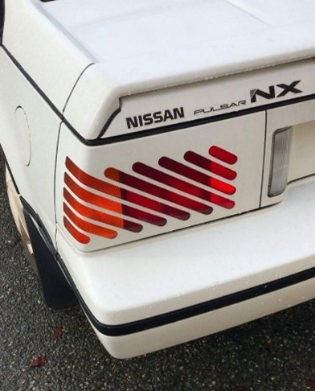
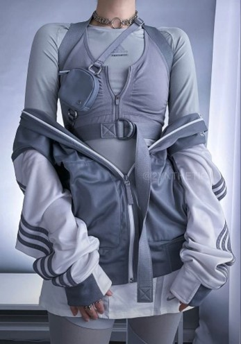
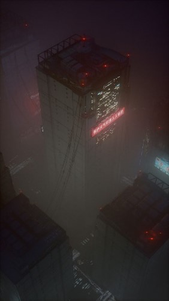
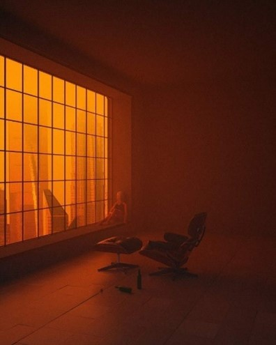

# TTT

## 1. Základní koncepce

Hra pod technickým názvem TTT (Train to Tokyo) je webová hra založená na přiřazování rolí hráčům. Každá role má své specifické cíle potřebné k výhře. Role jsou navrženy tak, aby si vzájemně odporovaly, což nutí hráče odhalit role svých oponentů a podle toho přizpůsobit svou strategii. Herní mechanika se skládá ze dvou opakujících se fází – v první fázi mohou hráči hlasovat o vyřazení jiného hráče, ve druhé fázi pak hráči se speciálními rolemi využívají své unikátní schopnosti.

## 2. Vizuální a technické zpracování

Vizuální stránka hry čerpá inspiraci především z estetiky her jako Cyberpunk 2077 a filmů jako Blade Runner 2049. Systém hlasování by se dal velmi vzdáleně přirovnat ke hře Among Us. Pro vývoj byla zvolena webová platforma, především kvůli snadné přístupnosti pro hráče a odstranění nutnosti instalace dodatečného software.

### Použité nástroje

• Grafický design: Aseprite, Figma, Blender
• Zvukový design: FL Studio 21 s VST pluginem Serum od Xfer
• Technologický stack: NextJS 15, TailwindCSS, pmndrs 3D stack a další pomocné nástroje

### Vývojové výzvy

Projekt čelí následujícím hlavním technickým výzvám:
• Kontrola herní logiky: Implementace a správa komplexních herních mechanik
• WebSocket komunikace: Zajištění plynulé real-time komunikace mezi hráči
• Vizuální a zvuková stránka: Vytvoření působivého audiovizuálního zážitku

## 3. Grafická část

Jak již bylo víše uvedeno, pro 3D scény jsem se rozhodl užít nástroj Blender. Pro sprity a UI využiji Aseprite a Figmu.
Inspirace vyplívá z mé představivosti a osobního souboru zdrojů na mém Pinterestu. Zde je výběr obrázků představující atmosféru.

## 4. Zvuky

Pro vývoj SFX užiji D.A.W. s názvem FL Studio a to verzi 21. Převážně pro tvorbu zvuku digitální syntetizér Serum od společnosti Xfer. Jako zdroj užiji licencované samply ze droje Splice a jednotlivé balíčky od umělců jako JoeB, Oddprophet či BeutNoise.

## 5. Hudba

Hudba sleduje stejné principy jako bod číslo 4.

# Roadmap

## Stack

- [x] NextJS 15
- [ ] pmndrs 3D stack
- [x] Tailwind 4, shadcn/ui as UI
- [x] React 19 & Compiler
- [x] DX Tools (Prettier, ESLint, ...)
- [x] Howler as Audio Provider
- [x] Posthog, Axiom, Vercel as Analytics
- [x] Sentry, ArcJet as Application Health

- ### WebSocket & Game State

    - [x] socket.io

    - [ ] Evaluate State Managment
        - [ ] Jotai as Global State
        - [ ] Zustand as State Machine

- ### DB

    - [ ] UpStash as Redis

    - [ ] Evaluate DB Provider
        - Turso as LibSQL
        - Neon as Postgres

## Game

- ### Game Lobby

    - [x] Player Join
    - [ ] Player leave
    - [ ] Show players joined
    - [ ] Room Leader
    - [ ] Player management
    - [ ] Ready state
    - [ ] Play action

- ### Game Loop

    - [ ] IN - OUT Phase
    - [ ] Voting
    - [ ] History

- ### Game Logic

    - [ ] Decision
    - [ ] Win conditions
    - [ ] Game Management

- ### Gameplay Overhaul
    - [ ] Game Test
    - [ ] Feedback
    - [ ] Working state

## UI

- [ ] UI
    > UI list contained in internal files.

## Audio

- [ ] Audio
    > Audio list contained in internal files.

## 3D

- [ ] Lobby
- [ ] Game Scene
- [ ] Scene Ambient

## Porting

- [ ] Steam

## I18N

- ### Multilingual
    - [ ] Evaluate Interlingual Provider/Tool
        - [ ] [next-intl](https://github.com/amannn/next-intl)
        - [ ] [Crowdin](https://crowdin.com/)
- ### Multi-Regional
    - [ ] ...

## A11Y

- [ ] ...

## Deploying

- [ ] Vercel for Front-End

- [x] Evaluate WebSocket service
    - ~~Railway~~
    - [ ] Fly.io
